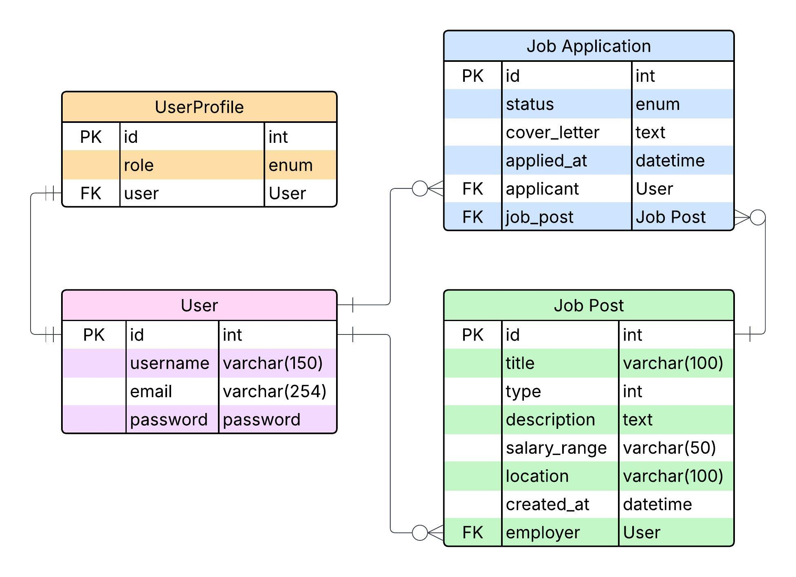

# Job Portal

A Django-based RESTful API for managing job postings and applications. This project allows employers to create 
and manage job posts, job seekers to apply for jobs, and provides a Swagger UI for API documentation.

## Features 
- **Job Post Management**: Employers can create, update, delete job post.
- **Job Applications**: Job seekers can submit applications and employer can manange these appliation.
- **Authentication**: Only Authorize users can submit application and see their applicatins. 
- **Filtering and Searching**: Filter job post by type and location, search by title and description.
- **Security**: Ownership checks ensure only modify their own resource and employer can change status of the application.
- **API Documentation**: Used Interactive Swagger UI 

## Tech Stack
- **Backend**: Django, DRF
- **Database**: SQLite
- **API Documentation**: drf-spectacular
- **Dependencies**: See [requirements.txt](requirements.txt) file.

## Database Schema
The following Entity-Relationship Diagram (ERD) illustrates the database structure, including `JobPost`, `JobApplication`, `User` and `UserProfile` models:



## Setup Instruction
### 1. Prerequisites
- python 3.12
- pip
- git

### 2. Clone the Repository
```bash 
git clone https://github.com/imsnto/job_portal.git
cd job_portal
```
### 3. Create a Virtual Environment 
```bash
python3 -m venv .venv
source .venv/bin/activate # On Windows: .venv\Script\activate
```

### 4. Install Dependencies
```bash
pip install -r requirements.txt
```

### 5. Apply Migrations 
```bash
python manage.py migrate
```

### 6. Create a Superuser
```bash
python manage.py createsuperuser
```

### 7. Run the Development Server
```bash
python manage.py runserver
```

## API Usage
### Accessing the API
- **Swagger UI**: View and test endpoints at `http://127.0.0.1:8000/api/docs/`.
- **Schema**: Download the OpenAPI schema at `http://127.0.0.1:8000/api/schema/`.

### Key Endpoints
- **Accounts**
    - `POST /accounts/login/` : Login and get token for authentication.
    - `POST /accounts/register/` : Register as a job seeker or employer.
- **Job Posts**
    - `GET /jobs/`: Get all the job posts. (Supports filtering: `?type=internship&location=dhaka` and searching: `?search=developer`)
    - `POST /jobs/` : Create a job. (Employer only)
    - `GET/PUT/PATCH/DELETE /jobs/{id}/` : Retrieve, update, delete a specific job post. (employer only)
- **Job Applications**
    - `GET /applications/`: Get all the applications. (Job seekers get only the applications they submitted, and employers get the applications submitted to their posts) 
    - `POST /applications/` : Submit an application. (Job Seekers only)
    - `GET/PUT/PATCH/DELETE /applications/{id}/` : Retrieve, update, delete a specific job application. (Job Seekers only (Must be the owner of the object))

## Authentication
- Used Token based authentication.
- Obtain a token when login return a token.
- Use token in header `Authorization: Token <token>` (if use postman)

## Project Structure
```
job-portal/
├── applications/
    ├── models.py
    ├── serializers.py
    ├── permissions.py
    ├── urls.py
    ├── views.py
├── job-portal/
    ├── settings.py
    ├── urls.py
├── jobs/
    ├── models.py
    ├── serializers.py
    ├── permissions.py
    ├── urls.py
    ├── views.py
├── users/
    ├── models.py
    ├── serializers.py
    ├── urls.py
    ├── views.py
├── docs
    ├── job_portal_ERD.jpeg
├── .gitignore
├── LICENSE
├── README.md
├── manage.py
├── requirements.txt
```
## License
Apache License. See [LICENSE](LICENSE) for details.
## Contact
For any queries, contact with me via [slmnsnto@gmail.com](mailto:slmnsnto@gmail.com) .
